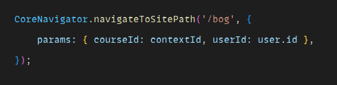
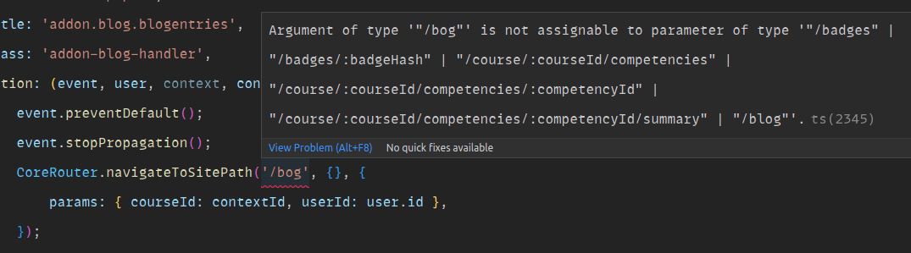
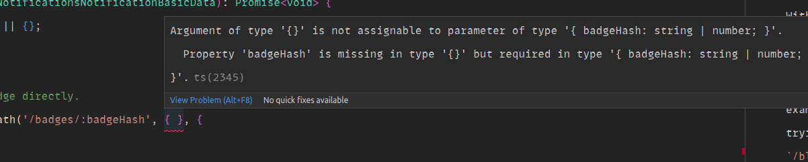
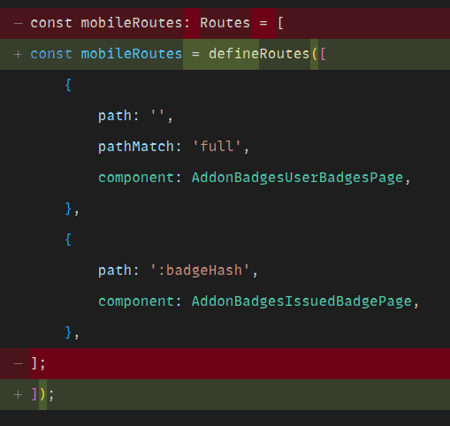
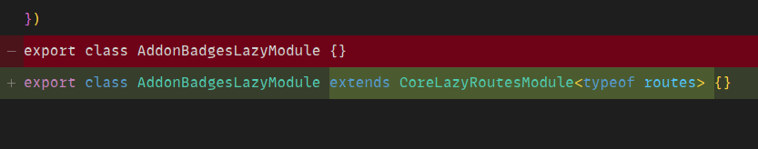
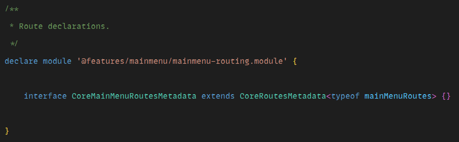
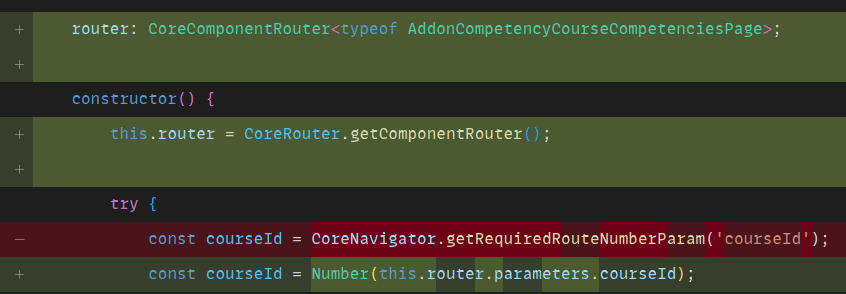
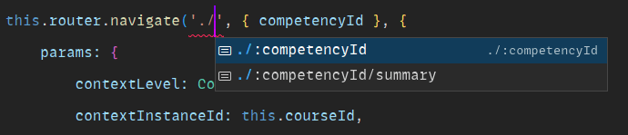

# Typed Routes POC

This branch is a proof-of-concept for implementing typed routes in the Moodle App.

## Using Typed Routes

With the current implementation, typos in route paths go unnoticed. For example, if you're trying to navigate to `/blog` but type `/bog` instead, there isn't any errors and you would only notice the mistake at runtime:

In this example, the problem would be easy to detect because the Blog is covered by E2E tests. However, there are many paths that aren't covered by tests, and this is [often a source of bugs](https://github.com/moodlehq/moodleapp/commit/29483572b7fe8acef0514c0aa17923bdca5cf129).

The solution introduced in this branch is to create a new class, called `CoreRouter`, with equivalent methods providing type safety:

One consequence of doing this is that route parameters can no longer form part of the string. Instead, we should use the placeholder and pass the replacements in a second argument.

This has the added benefit to provide type-safety to parameters as well:

At the moment, these are typed as `string | number`. But in the future, they could be narrowed down to concrete types, and we could also type query parameters (which are currently just typed `Record<string, any>`).

## Defining Typed Routes

In order for this to work, we need to provide type definitions when the routes are registered. This can be done with three new affordances.

To declare routes, we can use a the new `defineRoutes` helper instead of the `Routes` type from Angular:

Lazy modules can declare their routes extending the `CoreLazyRoutesModule` class:

And eager modules can declare their routes augmenting type declarations:

There are currently more use-cases in the app that haven't been explored in this proof of concept, but this shows how it would work most of the time.

## Component Routers

Another use-case that has been explored in this proof-of-concept is navigating to relative routes. The proposed solution entails instantiating a so-called "component router", which internally works the same way as the global router but its type-inference is scoped to the current component (they could also be called "page routers").

Currently, they can be used for relative navigation and reading query parameters. Eventually, they could introduce type-safety in query parameters as well.

## What's next?

The solution introduced here requires TypeScript version 4.1, but the app is currently using 3.9. At least until that is updated, we cannot start using this. It would be possible to achieve a similar result with older versions of TypeScript, but the DX wouldn't be as good and I don't think it's worth spending any time on that.

Other than that, this proof-of-concept hasn't been exhaustive with the entire code-base, and some edge cases have already been identified which aren't resolved. But the good news is that this solution can be introduced progressively, so once the app supports TypeScript 4.1 we can start the migration to a type-safe routing approach.

Here's a list of known limitations and use-cases to explore further:

- Route parameters don't have type inference (they are always `string | number`).
- Query parameters don't have type inference (they are always `Record<string, any>`).
- Nested `defineRoutes` calls doesn't work properly (for example, for a better DX when using the `conditionalRoutes` helper).
- Components which are declared in multiple routes haven't been tested.
- Parent relative paths (such as `../`, `../../`, etc.).
- Type-safety for reusable path segments (for example, `COURSE_PAGE_NAME`).
- Type-safety for paths constructed at runtime (for example, when `CoreNavigator.getRelativePathToParent` is called).
- Route types derived from dynamic definitions (for example, routes defined using `buildTabMainRoutes`).
